

# JoeScan

### Advanced Cybersecurity & OSINT Intelligence Platform

**Enterprise-grade cybersecurity intelligence platform with deep OSINT capabilities, real-time threat monitoring, automated daily news pipeline, and a cinematic dark-mode interface.**

🔗 **[Visit the Live Platform →](https://joescan.me)**

 

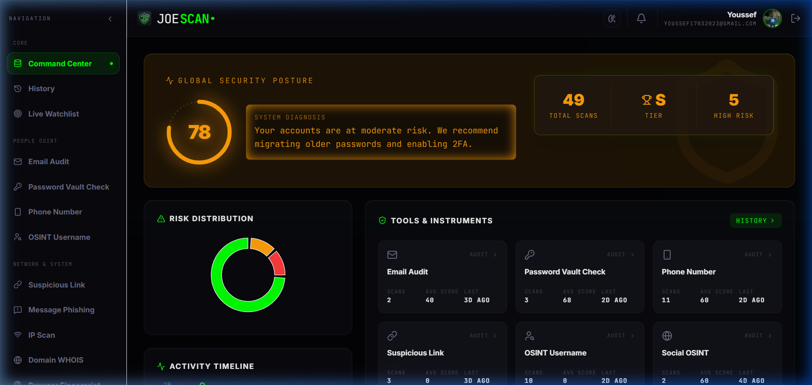

*The JoeScan Command Center — your security posture at a glance*

---

## ⚠️ Proprietary Notice

> **This repository is strictly proprietary.** All source code, design systems, digital assets, and operational logic are the exclusive intellectual property of **JoeTech / JoeScan**. Cloning, forking, redistributing, reverse-engineering, or local execution of any files within this repository is **prohibited without explicit written consent**. This README exists solely as a public-facing showcase of the platform's capabilities.

---

## 📖 Table of Contents

- [Platform Overview](#-platform-overview)
- [Command Center](#-command-center)
- [Scan History](#-scan-history)
- [Live Threat Watchlist](#-live-threat-watchlist)
- [Email Audit & Breach Scanner](#-email-audit--breach-scanner)
- [Password Vault Check](#-password-vault-check)
- [Phone Number OSINT](#-phone-number-osint)
- [OSINT Username](#-osint-username)
- [Suspicious Link Scanner](#-suspicious-link-scanner)
- [Message Phishing Detector](#-message-phishing-detector)
- [IP Scan](#-ip-scan)
- [Domain WHOIS Lookup](#-domain-whois-lookup)
- [Browser Fingerprinting](#-browser-fingerprinting)
- [Device Security](#-device-security)
- [Cybersecurity Blog](#-cybersecurity-blog)
- [Pricing & Tiers](#-pricing--tiers)
- [Technology](#-technology)

---

## 🌟 Platform Overview

JoeScan is a full-stack cybersecurity and OSINT (Open Source Intelligence) platform built for analysts, penetration testers, and security-conscious individuals. It consolidates over **12 specialized security tools** into a single, unified command center — eliminating the need to jump between fragmented online scanners.

The platform runs entirely at **[joescan.me](https://joescan.me)** with Firebase-backed user authentication, persistent scan histories, exportable PDF reports, and a fully automated cybersecurity news engine that publishes fresh articles every single day without human intervention.

### Core Capabilities at a Glance

| Category | Tools |
|:---------|:------|
| **People OSINT** | Email Audit, Password Vault Check, Phone Number, OSINT Username |
| **Network & System** | Suspicious Link Scanner, Message Phishing Detector, IP Scan, Domain WHOIS |
| **Advanced** | Browser Fingerprint, Device Security, Social OSINT, Live Threat Watchlist |
| **Intelligence** | Cybersecurity Blog, Automated Daily News, Scan History & Analytics |
| **Enterprise** | SIEM / Webhooks, Team Management, 3D Threat Globe, Cyber Academy |

---

## 🎯 Command Center

The **Command Center** is the operational nerve center of JoeScan. It provides a bird's-eye view of your entire security posture in one glance.

  

 

**What you see here:**

- **Global Security Posture Score (78/100):** A dynamically calculated score based on all scans performed across every tool. The circular gauge turns from red to green as your digital hygiene improves, with actionable recommendations in the System Diagnosis panel.
- **Quick Stats Panel:** Instant visibility into total scans completed (49), current subscription tier (S), and the number of high-risk findings detected (5).
- **Risk Distribution Chart:** A donut chart breaking down your scan results by severity — green for safe, orange for warnings, and red for critical vulnerabilities.
- **Tools & Instruments Grid:** Quick-access cards for every tool in the platform, each showing the number of scans run, average risk score, and time since last audit.
- **Activity Timeline:** A historical line graph tracking scan activity over time, letting you spot trends in your security behavior.

---

## 📋 Scan History

The **History** panel provides a centralized, searchable log of every security scan ever conducted on the platform.

  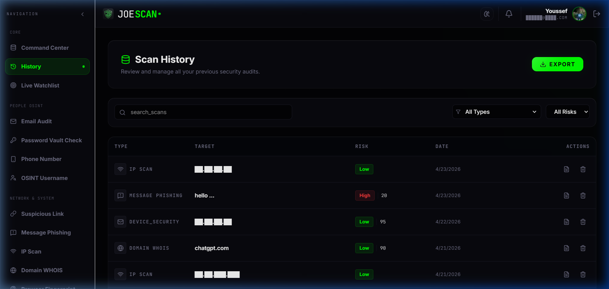

 

**Key Features:**

- **Universal Scan Log:** Every scan from every tool — IP Scan, Message Phishing, Device Security, Domain WHOIS, and more — is recorded in a single, unified table with columns for Type, Target, Risk Level, Date, and Actions.
- **Risk Badges:** Each entry is color-coded with risk severity badges (`Low` in green, `High` in red) for instant visual triage.
- **Search & Filter:** A real-time search bar lets you query by target (IP, domain, message), while dropdown filters for Type (All Types) and Risk (All Risks) help narrow down specific scan categories.
- **Export Function:** The green "EXPORT" button in the top-right generates a downloadable report of your complete scan history — perfect for compliance audits, incident reports, or client deliverables.
- **Per-Entry Actions:** Each row includes a copy/export icon and a delete (trash) icon, giving you granular control over individual records.

---

## 🎯 Live Threat Watchlist

The **Live Threat Watchlist** is JoeScan's early-warning detection system for continuous infrastructure monitoring.

  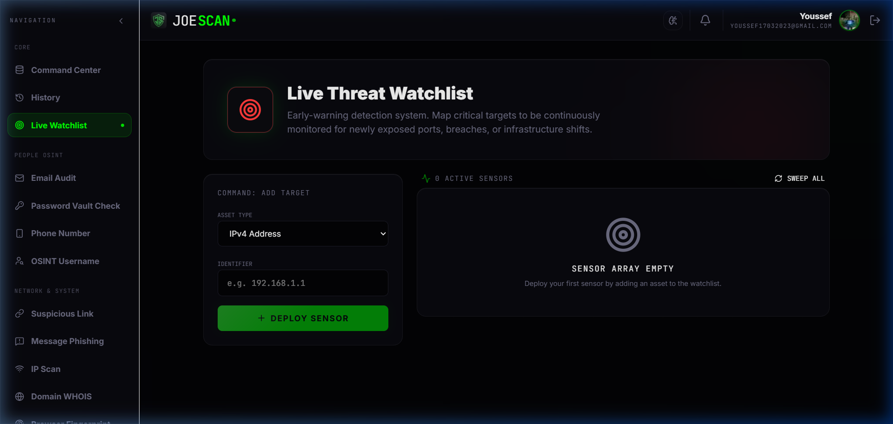

 

**What this tool does:**

- **Continuous Monitoring:** Map critical assets (IPv4 addresses, domains, email addresses) for around-the-clock surveillance. Once a target is deployed as a "sensor," JoeScan watches for newly exposed ports, unexpected DNS changes, certificate expirations, and breach appearances.
- **Asset Types Supported:** IPv4 Addresses, IPv6 Addresses, Domain Names, Email Addresses, and URL endpoints.
- **Sensor Array:** Each deployed target becomes an active sensor in the array. The "Sweep All" command triggers a simultaneous re-scan of every active sensor, giving you an instant snapshot of your infrastructure's health.
- **Automated Alerting:** When a watchlisted asset is detected in a new breach database or shows anomalous port activity, the system flags it on the Command Center dashboard.

---

## 📧 Email Audit & Breach Scanner

The **Email Audit** tool performs deep reconnaissance against global data leak repositories to determine if an email address has been compromised.

  

 

**How it works:**

- **Breach Detection Engine:** Enter any email address and hit "ANALYZE." The engine cross-references the target against massive global leak databases — covering password dumps, credential stuffing lists, dark web marketplaces, and corporate data breaches.
- **Risk Rating System:** Results are classified with a severity badge: `LOW`, `MEDIUM`, `HIGH`, or `CRITICAL`. The example shows `test@example.com` flagged as **HIGH** risk with a Security Posture Score of only **5/100**.
- **Score Factors & Remediation:** The right panel breaks down exactly *why* the score is low (multiple breaches, diverse compromised data types, recent activity) and provides a green "How To Improve" section with actionable recommendations.
- **PDF Export & Sharing:** Every scan result can be downloaded as a professional PDF report or shared directly via a unique link — perfect for including in client security assessments or compliance audits.
- **Scan History:** The platform remembers every scan with timestamps, allowing users to track whether remediation steps have improved security over time.

---

## 🔑 Password Vault Check

The **Password Vault Check** evaluates password strength algorithmically in real-time and audits credentials against neural-network breach databases.

  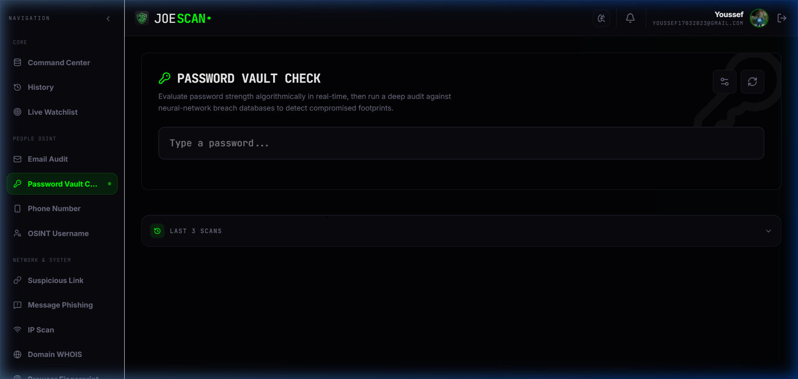

 

**Key Features:**

- **Real-Time Entropy Analysis:** As you type a password, the tool instantly calculates its cryptographic entropy, character diversity, length score, and estimated brute-force crack time — from seconds to centuries.
- **Breach Database Cross-Check:** Beyond just strength analysis, the tool checks the password hash (not the plaintext) against databases of known compromised credentials. If your exact password appears in a previous data breach, you'll know immediately.
- **Zero-Network Architecture:** Password evaluation happens entirely client-side. Your keystrokes are **never transmitted** over the network. The entropy calculation, pattern detection, and strength scoring all run locally in the browser — ensuring absolute privacy.
- **Last 3 Scans History:** A collapsible panel tracks your recent password audits for comparison and improvement tracking.
- **Password Generator:** Built-in tools to generate cryptographically strong passwords that pass all security checks.

---

## 📱 Phone Number OSINT

The **Phone Number** tool performs intelligence gathering on cellular numbers across global telecom networks.

  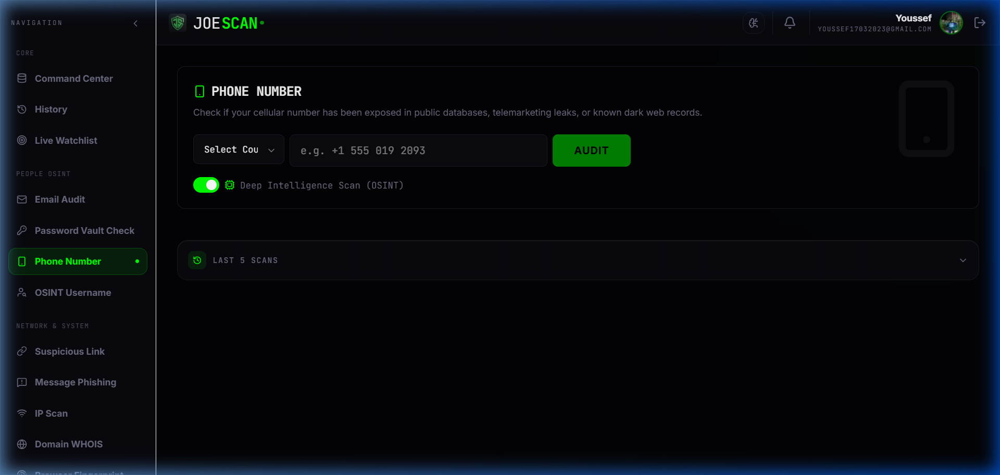

 

**Capabilities:**

- **Global Coverage:** Supports international phone formats with a country selector dropdown. Enter any number from any country and the system will normalize and process it.
- **Carrier & Line Identification:** Identifies the telecom carrier, line type (mobile, landline, VoIP), and registration region associated with the number.
- **Deep Intelligence Scan (OSINT):** Toggle on the "Deep Intelligence Scan" for an extended investigation that searches public directories, telemarketing leak databases, social media profile associations, and known dark web exposure records tied to the number.
- **Exposure Detection:** Flags whether the number has appeared in any known data breaches, SIM-swap attack databases, or spam/scam registries.
- **Last 5 Scans:** Persistent history of all phone audits with timestamps and results.

---

## 👤 OSINT Username

The **OSINT Username** tool investigates digital footprints across the web for a specific handle or profile name.

  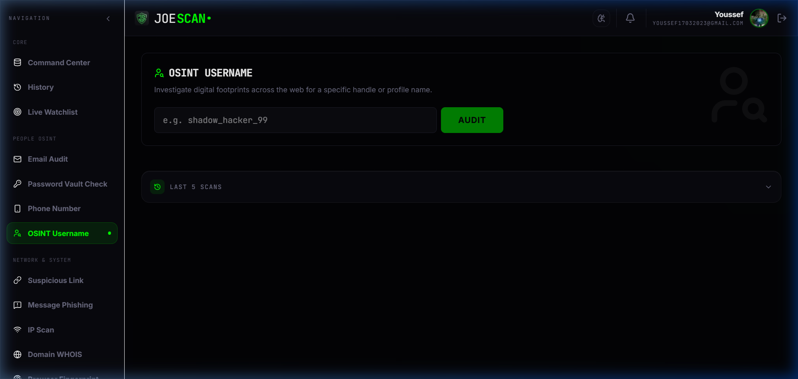

 

**Capabilities:**

- **Cross-Platform Search:** Enter any username (e.g., `shadow_hacker_99`) and the engine scans hundreds of platforms — social media, forums, code repositories, gaming networks, and more — to map where that identity exists online.
- **Profile Aggregation:** Results are compiled into a unified dossier showing profile links, account creation dates (where available), and activity status across discovered platforms.
- **Exposure Risk Assessment:** The tool evaluates how much personal information is publicly linked to the username, flagging accounts that expose real names, emails, or locations.
- **Investigation Use Cases:** Ideal for background checks, brand monitoring, insider threat investigations, and competitive intelligence gathering.
- **Last 5 Scans:** Full audit trail of all username investigations with timestamped results.

---

## 🔗 Suspicious Link Scanner

The **Suspicious Link** tool analyzes any URL for phishing attempts, malware distribution, or deceptive domains.

  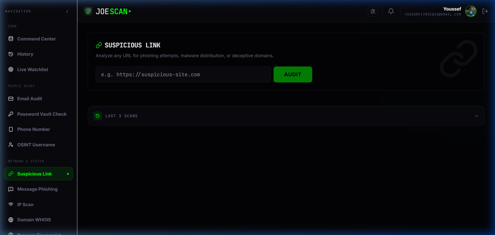

 

**What it detects:**

- **Phishing Detection:** Identifies typosquatting domains, homoglyph attacks, and URL obfuscation techniques designed to impersonate legitimate websites.
- **Malware Analysis:** Checks the destination URL against known malware distribution lists, scanning for drive-by downloads, exploit kits, and malicious redirects.
- **SSL/TLS Verification:** Validates the target's SSL certificate chain, expiration status, and issuing authority to detect forged or self-signed certificates.
- **Reputation Scoring:** Cross-references the domain against multiple threat intelligence feeds to produce a composite safety score.
- **Last 3 Scans:** Quick access to your recent link audits for comparison.

---

## 💬 Message Phishing Detector

The **Message Phishing** tool uses AI-powered analysis to detect social engineering and scam markers in raw text.

  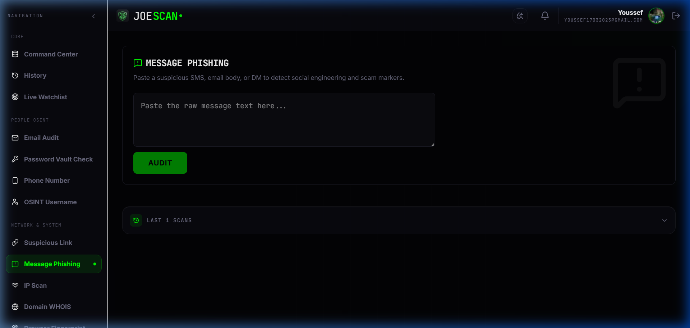

 

**How it works:**

- **Paste & Analyze:** Simply paste the raw text of any suspicious SMS, email body, WhatsApp message, or DM into the text area and click "AUDIT."
- **Social Engineering Detection:** The AI engine scans for common manipulation tactics — urgency triggers ("your account will be suspended"), authority mimicry ("from your bank"), emotional exploitation, and reward-based lures.
- **Embedded Link Extraction:** Any URLs found within the pasted message are automatically extracted and analyzed through the Suspicious Link engine.
- **Confidence Score:** Results include a percentage-based confidence level indicating how likely the message is to be a phishing attempt.
- **Last 1 Scans:** Audit trail of your most recent message analysis with full results.

---

## 🌐 IP Scan

The **IP Scan** tool examines any IPv4 or IPv6 address for botnet activity, VPN/Tor usage, and geographical tracing.

  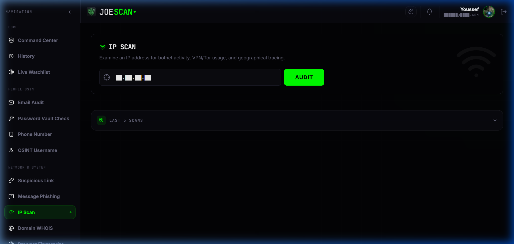

 

**What it reveals:**

- **Geolocation Mapping:** Resolves the IP address to its physical location — country, region, city, and approximate coordinates — with ISP and ASN (Autonomous System Number) identification.
- **Threat Intelligence:** Cross-references the IP against global blocklists, botnet command & control databases, and known malicious IP registries.
- **VPN/Proxy/Tor Detection:** Identifies whether the IP address is associated with a VPN provider, proxy service, or Tor exit node — critical for fraud prevention and access control.
- **Port Exposure:** Scans for commonly exploited open ports and services running on the target IP.
- **Last 5 Scans:** Complete history of all IP investigations for trend analysis.

---

## 🌍 Domain WHOIS Lookup

The **Domain WHOIS** tool queries domain registration data, DNS records, and server geolocation for any domain.

  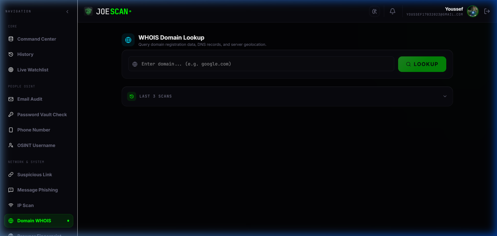

 

**Data retrieved:**

- **Registration Details:** Domain registrar, registration date, expiration date, last update, and DNSSEC status.
- **Registrant Information:** Contact details for the domain owner (where not privacy-protected), including organization, country, and name servers.
- **DNS Record Analysis:** Full DNS record dump including A, AAAA, MX, NS, TXT, CNAME, and SOA records — essential for infrastructure mapping and email authentication verification (SPF, DKIM, DMARC).
- **Server Geolocation:** Physical hosting location of the domain's primary server with ISP identification.
- **PDF Export:** Full WHOIS results can be exported as a professional PDF report for documentation.
- **Last 3 Scans:** Persistent history of all domain lookups.

---

## 🖥️ Browser Fingerprinting

The **Browser Fingerprint** tool reveals how websites can uniquely identify and track you across the web — even without cookies.

  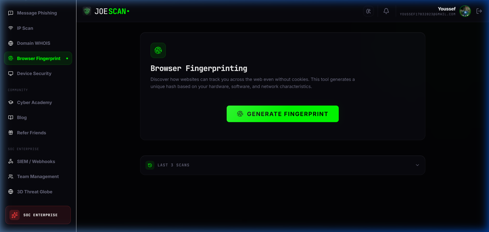

 

**What it exposes:**

- **Unique Hash Generation:** Click "GENERATE FINGERPRINT" and the tool collects dozens of browser attributes — screen resolution, installed fonts, WebGL renderer, canvas hash, timezone, language, available plugins, and hardware concurrency — to produce a unique identifier hash.
- **Tracking Awareness:** The generated fingerprint shows you exactly how unique your browser configuration is across the internet. If your fingerprint is rare, websites can track you without ever setting a cookie.
- **Privacy Recommendations:** Based on your fingerprint uniqueness score, the tool provides actionable steps to reduce trackability — such as using privacy-focused browsers, disabling WebGL, or standardizing font stacks.
- **Comparison History:** The "Last 3 Scans" panel lets you compare fingerprints before and after implementing privacy measures, confirming their effectiveness.

---

## 🔒 Device Security

The **Device Security** tool performs a comprehensive scan of your network exposure, open ports, browser telemetry, and checks public CVE databases via Shodan InternetDB.

  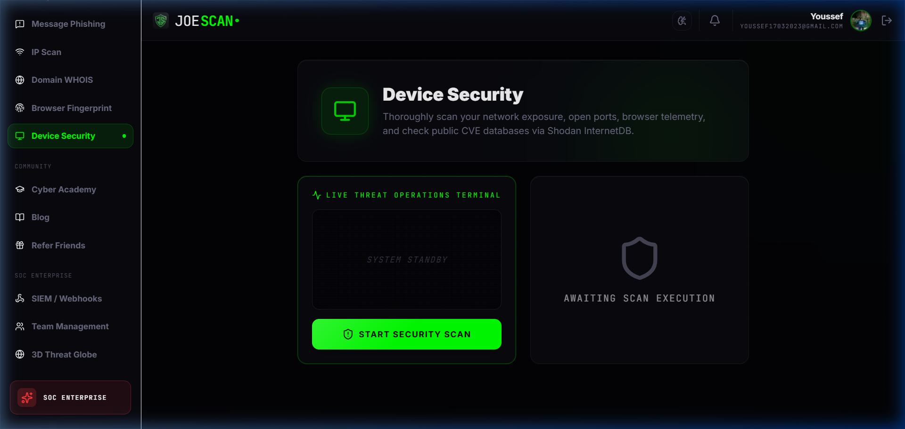

 

**What it scans:**

- **Live Threat Operations Terminal:** A real-time terminal output shows the scan progress as JoeScan queries external intelligence sources about your device's public-facing IP.
- **Network Exposure Analysis:** Identifies open ports, running services, and their versions on your current network — highlighting anything that shouldn't be publicly accessible.
- **CVE Cross-Reference:** Discovered services are automatically checked against the CVE (Common Vulnerabilities and Exposures) database to flag known vulnerabilities in your software stack.
- **Shodan InternetDB Integration:** Leverages Shodan's InternetDB API to retrieve intelligence about your IP's historical exposure, including past port scans and known vulnerability associations.
- **Shield Status:** The scan produces an overall device security rating displayed alongside the shield icon — covering firewall status, encryption protocols, and service hardening.

---

## 📰 Cybersecurity Blog

The **Blog** features a dual-source content engine: hand-crafted expert articles combined with a fully automated daily news pipeline.

  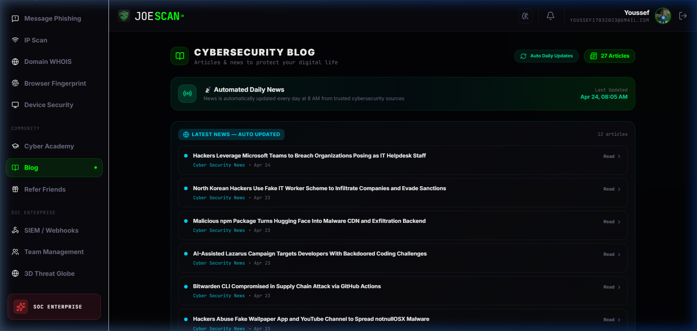

 

**Content System:**

- **Automated Daily News:** A GitHub Actions pipeline runs every day at **8:00 AM (Cairo time)**, scraping trusted cybersecurity RSS feeds (Cyber Security News, The Hacker News, etc.), normalizing the data into JSON, committing it to the repository, and triggering an automatic site rebuild and deployment. Zero human intervention required.
- **27 Articles Strong:** The blog currently hosts 27 articles — a mix of static expert-written content and dynamically sourced news — all rendered with the same premium glassmorphism card design.
- **14-Day Freshness Filter:** Automated news articles older than 14 days are automatically culled from the feed, ensuring the content always feels current and relevant.
- **In-App Article Reader:** Every article opens within JoeScan's native reader — no external redirects. Users stay within the platform's secure ecosystem at all times.
- **Last Updated Timestamp:** The header displays the exact last update time (e.g., "Apr 24, 08:05 AM") so users know how fresh the content is.

---

## 💎 Pricing & Tiers

JoeScan offers a three-tier pricing model designed to scale from individual researchers to enterprise security operations centers.

  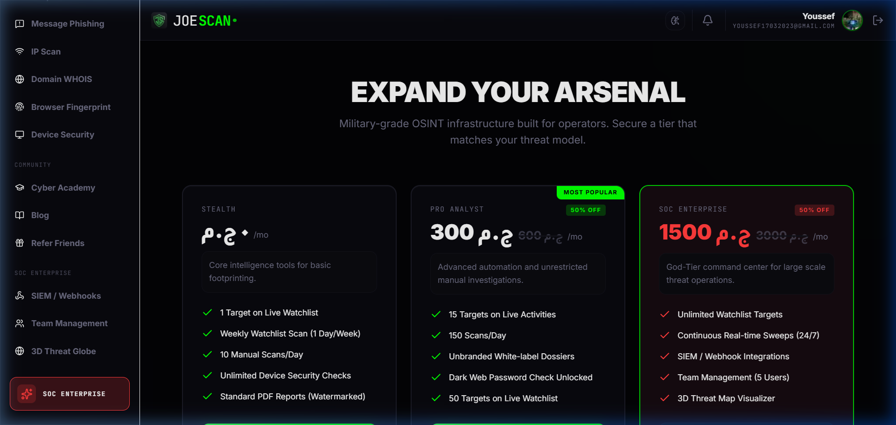

 

**Available Plans:**

| Feature | Stealth (Free) | Pro Analyst (50% OFF) | SOC Enterprise (50% OFF) |
|:--------|:---------------|:----------------------|:-------------------------|
| **Daily Scans** | 10 Manual Scans/Day | 150 Scans/Day | Unlimited |
| **Watchlist Targets** | 1 Target | 50 Targets | Unlimited Targets |
| **Watchlist Frequency** | Weekly (1 Day/Week) | On-Demand | Continuous 24/7 |
| **PDF Reports** | Standard (Watermarked) | Unbranded White-label | Unbranded White-label |
| **Device Security** | Unlimited | Unlimited | Unlimited |
| **Dark Web Password Check** | ❌ | ✅ | ✅ |
| **SIEM / Webhook Integration** | ❌ | ❌ | ✅ |
| **Team Management** | ❌ | ❌ | ✅ (5 Users) |
| **3D Threat Map Visualizer** | ❌ | ❌ | ✅ |

---

## ⚡ Technology

| Layer | Stack |
|:------|:------|
| **Frontend** | React 18 · TypeScript · Vite |
| **Styling** | Custom Dark Theme with Glassmorphism |
| **Auth & Database** | Firebase Authentication · Firestore |
| **CI/CD** | GitHub Actions (automated builds + daily news pipeline) |
| **Hosting** | GitHub Pages with custom domain (`joescan.me`) |
| **News Automation** | RSS scraping → JSON normalization → auto-commit → instant deploy (daily at 8:00 AM EGY) |

---

  © 2026 JoeScan by JoeTech. All rights reserved.
   
  Built with obsession for Cybersecurity & OSINT.

