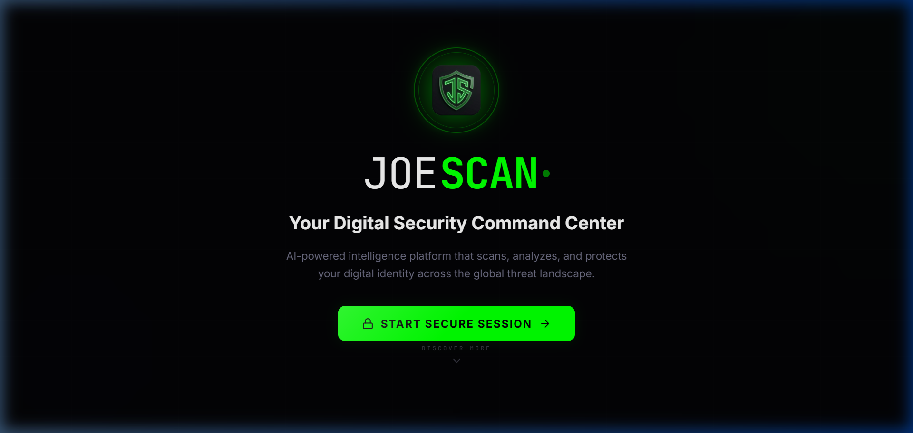
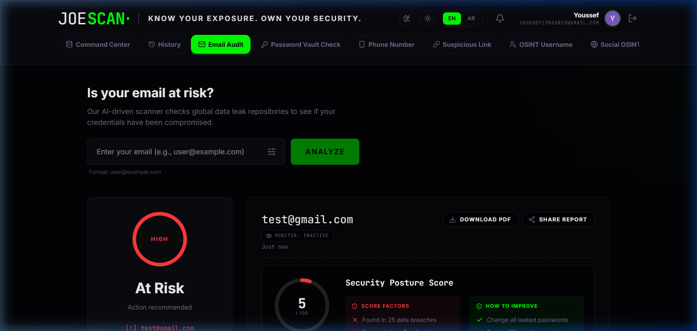
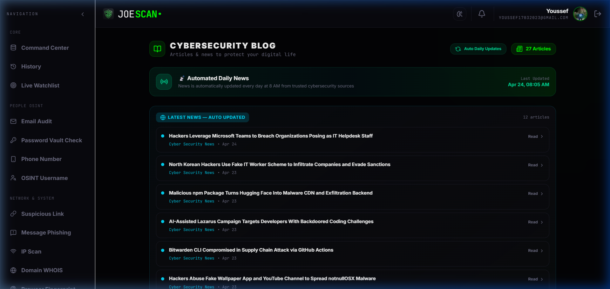
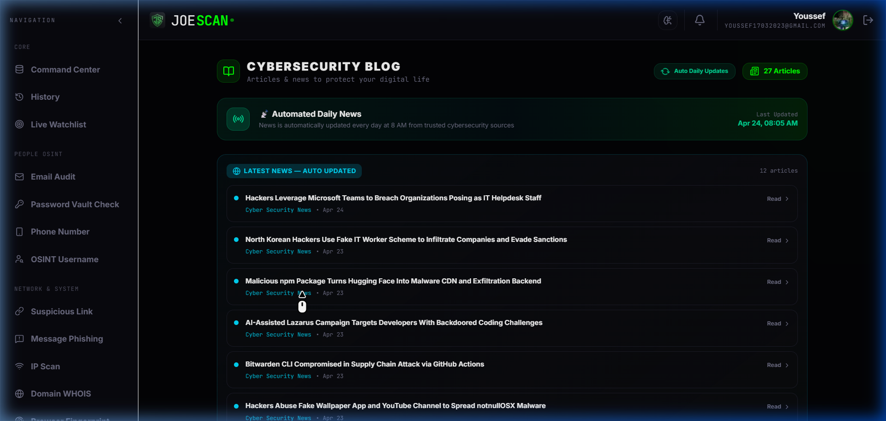
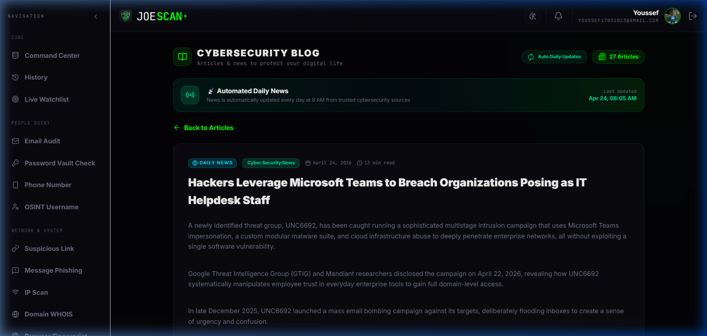

  <h1>🛡️ JoeScan — Advanced Cybersecurity & OSINT Intelligence Platform</h1>

  
<strong>Proprietary enterprise-grade cybersecurity platform featuring deep OSINT tools, real-time vulnerability scanning, and a fully automated daily news pipeline.</strong>

  
  
  

---

## 🔒 Platform Status & Licensing
**Notice:** JoeScan is a **proprietary, closed-source platform**. This repository serves exclusively as a visual showcase and a backend deployment pipeline for the production environment at `joescan.me`. 

The source code, operational logic, and specific digital assets within this repository are proprietary. **They are strictly not permitted for cloning, local installation, redistribution, or modification by any third party.** 

*Note: There are no "Run Locally" or installation instructions provided as this platform is operated solely by the original author to protect its intellectual property and operational security.*

---

## 🌟 Platform Showcase
JoeScan is engineered with a premium, cinematic dark-mode aesthetic (Glassmorphism) combined with military-grade investigative tools. Below is an exhaustive look at the platform's core operational features.

### 1. The Command Center (Dashboard)
The nerve center of JoeScan. It provides instant access to global OSINT operations, network scans, and analytical history in a cohesive, distraction-free environment.
 

  

 

### 2. Deep Email Audit & Breach Reconnaissance
Advanced email footprint tracking. Users can initiate deep scans to uncover associated password breaches, leaked datasets, and compromised accounts linked to any target email across known darker networks.
 

  

 

### 3. Dedicated Cybersecurity Blog
A fully featured, English-first technical blog built directly into the platform. Complete with dynamic article tracking and specialized categorization to keep users incredibly informed while exploring the site.
 

  

 

### 4. Zero-Touch Automated News Pipeline
JoeScan features a background GitHub Actions pipeline that automatically scrapes, formats, and publishes the latest global cybersecurity news every single day at 8:00 AM (Egypt Time). It intrinsically filters out obsolete news (older than 14 days) and sorts chronologically to ensure ultimate freshness.
 

  

 

### 5. Seamless In-App Reading Engine
Articles and news are parsed locally via a custom Markdown engine. Our integrated Scroll-to-Top physics ensure that readers get a premium, distraction-free reading experience without ever navigating away from the platform's ecosystem.
 

  

---

## 🛠️ The Tech Stack Arsenal
* **Frontend Architecture:** React 18 / Vite / TypeScript
* **Styling & UX:** TailwindCSS (Hyper-customized with specific hex gradients and blur utilities for cinematic glassmorphism)
* **Automation Engineering:** Fully automated CI/CD via GitHub Actions for daily news fetching and instantaneous static builds.
* **Database & Auth:** Firebase architecture for secure user state management and real-time database queries.

---

  © 2026 JoeScan. All rights reserved. Built with passion for Cybersecurity & OSINT.

